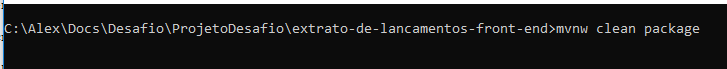

# Desafio CIELO - Front-End

Front-end que exibe as informações de Extrato de Lançamentos em conta na tela

### Tecnologia utilizada

Spring Boot

Angular v1.7.6

Bootstrap 4

Eclipse IDE

### Para compilar:

mvnw clean package

### Para executar:
java –jar target/target/extrato-de-lancamentos-frontend-0.0.1-SNAPSHOT.jar

### Evidências de testes:

Recuperando os dados do legado

Incluindo mais dados no json legado

Serviço indisponível

Erro no json legado

Arquivo json legado não encontrado

